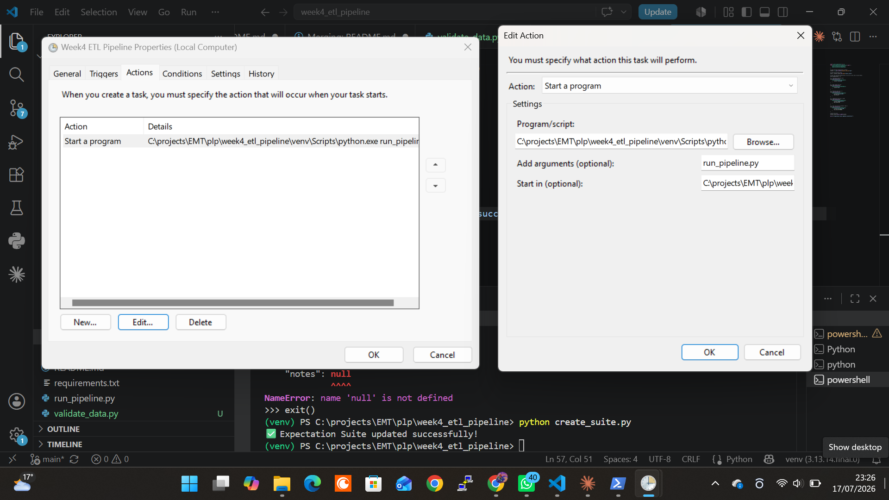

# Week 4 ETL Pipeline

## Project Overview

This project implements an automated ETL (Extract, Transform, Load) pipeline for operational sensor data.

The pipeline:

- Extracts raw sensor data from CSV
- Cleans and transforms the data
- Validates data quality
- Loads clean data into SQLite
- Logs every execution

---

## Project Structure

```
week4_etl_pipeline
│
├── data
├── expectations
├── logs
├── run_pipeline.py
├── requirements.txt
├── .env
└── README.md
```

---

## Installation

Clone the repository

```
git clone https://github.com/YOUR_USERNAME/week4_etl_pipeline.git
```

Create virtual environment

```
python -m venv venv
```

Activate

Windows

```
venv\Scripts\activate
```

Install packages

```
pip install -r requirements.txt
```

---

## Environment Variables

Create a `.env` file.

Example:

```
DATA_PATH=data/raw/ops_sensor_log_dirty.csv
DB_PATH=data/processed/cleaned_data.db
PRESSURE_MIN=0
TEMP_MAX=100
```

---

## Running the Pipeline

```
python run_pipeline.py
```

---

## Validation Rules

- No null timestamps
- Pressure ≥ 0
- Temperature ≤ 100
- No null Zone
- Flow Rate > 0

---

## Logging

Logs are stored in:

```
logs/pipeline.log
```

---

## Idempotency

The pipeline replaces the SQLite table on every execution to avoid duplicate records.

```
if_exists="replace"
```

---

## Great Expectations

Successfully created the Expectation Suite.


## Data Quality Validation

This project uses **Great Expectations** to enforce data quality checks before loading data into SQLite.

Validation rules include:

- Timestamp values must not be null
- Pressure values must be greater than or equal to zero
- Temperature values must be within the configured range
- Zone values must not be null
- Flow rate values must be positive

### Great Expectations Report

The generated validation report can be viewed here:

[Great Expectations Data Quality Report](reports/Great_Expectations_Data_Quality_Report.pdf)

### Validation Screenshot




## Project Report

Full documentation:

[Week 4 ETL Pipeline Report](reports/Week4_ETL_Pipeline_Report.md)

## Validation Evidence


## Author


## Kelvin Moruri ##